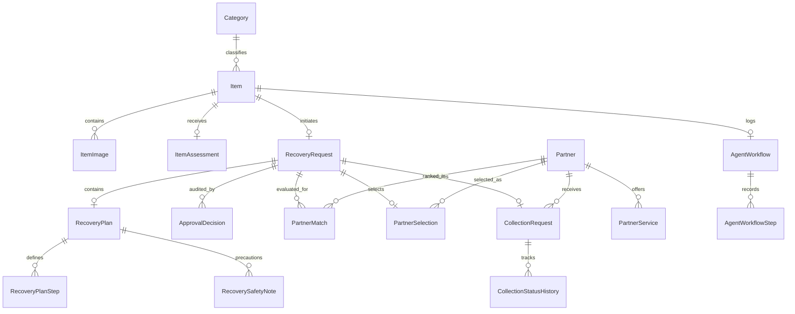

# LoopWorth Database Design

## 1. Design Principles & Migration Policy
LoopWorth adheres strictly to the team migration policy:
- **Single DbContext**: Only `LoopWorth.Infrastructure.Data.AppDbContext` manages schema and tables.
- **Audit Preservation**: Historical logs and decisions use `DeleteBehavior.Restrict` to ensure that audit trails and past milestones cannot be destructively cascade-deleted.
- **String Enums**: All domain enums are persisted as strings for readability, schema longevity, and direct database inspection.

## 2. Entity Relational Model

## 3. Data Dictionary

### Core Tables
- **`Categories`**: `Id` (PK Guid), `Code` (Unique text), `Name` (Text), `IsActive` (Boolean).
- **`Items`**: `Id` (PK Guid), `CustomerId` (FK AspNetUsers), `CategoryId` (FK Categories), `Name` (Text), `Brand` (Nullable text), `Model` (Nullable text), `ConditionDescription` (Text), `Status` (ItemStatus string), `SelectedRecoveryRoute` (Nullable RecoveryRoute string), `CreatedAt`, `UpdatedAt`.
- **`ItemImages`**: `Id` (PK Guid), `ItemId` (FK Items), `ImageUrl` (Text), `SortOrder` (Int), `IsPrimary` (Bool).
- **`ItemAssessments`**: `Id` (PK Guid), `ItemId` (FK Items 1:1), `ConditionLevel` (ConditionLevel string), `RecommendedRoute` (RecoveryRoute string), `AlternativeRoute` (Nullable string), `ConfidenceLevel` (ConfidenceLevel string), `Explanation` (Text), `CreatedAt`.

### Recovery Tables
- **`RecoveryRequests`**: `Id` (PK Guid), `ItemId` (FK Items 1:1), `CustomerId` (FK AspNetUsers), `SelectedRoute` (RecoveryRoute string), `Status` (RecoveryStatus string), `SubmittedAt` (Nullable DateTime), `CreatedAt`, `UpdatedAt`.
- **`RecoveryPlans`**: `Id` (PK Guid), `RecoveryRequestId` (FK RecoveryRequests 1:1), `Suitability` (Text), `Summary` (Text), `RequiredPartnerType` (Text), `CreatedAt`.
- **`RecoveryPlanSteps`**: `Id` (PK Guid), `RecoveryPlanId` (FK RecoveryPlans), `StepText` (Text), `SortOrder` (Int).
- **`RecoverySafetyNotes`**: `Id` (PK Guid), `RecoveryPlanId` (FK RecoveryPlans), `NoteText` (Text), `SortOrder` (Int).
- **`ApprovalDecisions`**: `Id` (PK Guid), `RecoveryRequestId` (FK RecoveryRequests), `AdminId` (FK AspNetUsers), `Decision` (String: Approved / Rejected / RevisionRequested), `Reason` (Nullable text), `DecidedAt`.

### Partners & Logistics Tables
- **`Partners`**: `Id` (PK Guid), `Name` (Text), `ContactName` (Text), `Email` (Text), `Phone` (Nullable text), `ServiceArea` (Text), `OperatingHours` (Nullable text), `AverageProcessingDays` (Int), `IsActive` (Bool), `CreatedAt`, `UpdatedAt`.
- **`PartnerServices`**: `Id` (PK Guid), `PartnerId` (FK Partners), `CategoryId` (FK Categories), `RecoveryRoute` (RecoveryRoute string).
- **`PartnerMatches`**: `Id` (PK Guid), `RecoveryRequestId` (FK RecoveryRequests), `PartnerId` (FK Partners), `Rank` (Int), `Reason` (Text), `CreatedAt`.
- **`PartnerSelections`**: `Id` (PK Guid), `RecoveryRequestId` (FK RecoveryRequests 1:1), `PartnerId` (FK Partners), `CustomerId` (FK AspNetUsers), `SelectedAt`.
- **`CollectionRequests`**: `Id` (PK Guid), `RecoveryRequestId` (FK RecoveryRequests 1:1), `PartnerId` (FK Partners), `CustomerId` (FK AspNetUsers), `PreferredPickupDate`, `PreferredStartTime`, `PreferredEndTime`, `SuggestedPickupDate`, `SuggestedStartTime`, `SuggestedEndTime`, `SuggestedCollectionAgentId`, `ScheduledPickupDate`, `ScheduledStartTime`, `ScheduledEndTime`, `AssignedCollectionAgentId` (Nullable FK AspNetUsers), `Status` (CollectionStatus string), `CreatedAt`, `UpdatedAt`.
- **`CollectionStatusHistories`**: `Id` (PK Guid), `CollectionRequestId` (FK CollectionRequests), `Status` (CollectionStatus string), `ChangedByUserId` (FK AspNetUsers), `Note` (Nullable text), `ChangedAt`.
- **`CollectionAgentProfiles`**: `Id` (PK Guid), `UserId` (FK AspNetUsers 1:1), `Phone` (Nullable text), `ServiceArea` (Text), `IsAvailable` (Bool), `IsActive` (Bool), `CreatedAt`, `UpdatedAt`.

### Workflow & Auditing Tables
- **`AgentWorkflows`**: `Id` (PK Guid), `CustomerId` (FK AspNetUsers), `ItemId` (FK Items), `Objective` (Text), `CurrentStage` (Text), `Status` (Text), `CreatedAt`, `CompletedAt`.
- **`AgentWorkflowSteps`**: `Id` (PK Guid), `AgentWorkflowId` (FK AgentWorkflows), `AgentName` (Text), `StepName` (Text), `ExecutionStatus` (AgentExecutionStatus string), `InputSummary` (Nullable text), `OutputSummary` (Nullable text), `ErrorMessage` (Nullable text), `StartedAt`, `CompletedAt`.
